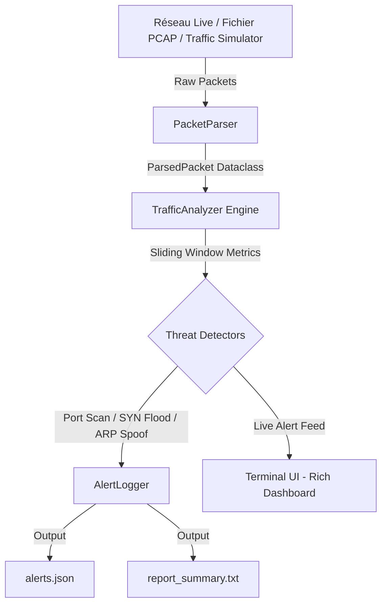

# 🛡️ NetGuard-CLI

[](https://www.python.org/downloads/)
[](https://opensource.org/licenses/MIT)
[]()
[]()

**NetGuard-CLI** est un système de détection d'intrusions réseau (NIDS) léger, modulaire et performant écrit en Python. Il réalise la capture de paquets, l'analyse comportementale du trafic en temps réel et la détection d'anomalies de sécurité (scans de ports, DoS SYN Flood, ARP Poisoning, exfiltration DNS).

---

## 🌟 Fonctionnalités Clés

* 🔍 **Inspection Profonde des Paquets (DPI)** : Décodage des couches Ethernet (L2), IP/IPv6 (L3), TCP/UDP/ICMP/ARP (L4) et DNS (L7).
* 🚨 **Moteur de Détection d'Attaques en Temps Réel** :
  * **Port Scanning** : Balayage de ports via fenêtres glissantes temporisées.
  * **SYN Flood Attack (DoS)** : Détection des connexions semi-ouvertes et inondations TCP.
  * **ARP Poisoning / Spoofing** : Surveillance des changements d'adresses MAC/IP (Attaques Man-in-the-Middle).
  * **DNS Tunneling Anomaly** : Identification des requêtes DNS anormales et exfiltration de données.
* 📊 **Dashboard Terminal Dynamique** : Interface moderne basée sur `Rich` affichant la répartition du trafic et les alertes en direct.
* 📄 **Persistance & Rapports JSON** : Exportation automatique des alertes au format JSON structuré et rapports récapitulatifs texte pour équipes SOC.
* ⚙️ **Mode Simulation Sans Privilèges** : Générateur de trafic synthétique permettant d'exécuter et de tester l'application sans droits Administrateur / root.

---

## 🏗️ Architecture du Projet



---

## 🚀 Installation & Prise en Main

### 1. Prérequis
* Python 3.9 ou supérieur
* Git

### 2. Cloner le dépôt
```bash
git clone https://github.com/<votre-username>/NetGuard-CLI.git
cd NetGuard-CLI
```

### 3. Créer un environnement virtuel et installer les dépendances
```bash
python -m venv .venv
# Sur Windows :
.venv\Scripts\activate
# Sur Linux/macOS :
source .venv/bin/activate

pip install -r requirements.txt
```

---

## 💻 Exemples d'Utilisation

### ⚙️ Mode 1 : Simulation / Démo (Recommandé pour tester rapidement)
Génère du trafic et des attaques fictives pour observer la détection en direct sans privilèges réseau :
```bash
python -m netguard.main --simulate
```

### 📁 Mode 2 : Analyse d'un Fichier PCAP (Hors-ligne)
Analyse une capture réseau `.pcap` existante (issue de Wireshark ou tcpdump) :
```bash
python -m netguard.main --pcap /chemin/vers/votre_capture.pcap
```

### 📡 Mode 3 : Capture en Direct sur une Interface Réseau (Requis Admin/Root)
```bash
# Sur Windows (invite de commande Administrateur) :
python -m netguard.main --interface "Wi-Fi"

# Sur Linux (sudo) :
sudo python3 -m netguard.main --interface eth0
```

---

## 🧪 Exécution des Tests Unitaires

Le projet inclut des tests automatisés couvrant le décodage de paquets et les algorithmes de détection d'anomalies :

```bash
python -m unittest discover -s tests
```

Rendu attendu :
```text
.....
----------------------------------------------------------------------
Ran 5 tests in 0.001s

OK
```

---

## 📊 Exemple d'Alerte Générée (`alerts.json`)

```json
[
    {
        "timestamp": 1727446000.123,
        "formatted_time": "16:06:40",
        "severity": "CRITICAL",
        "type": "SYN_FLOOD",
        "source": "192.168.1.66",
        "target": "192.168.1.1",
        "description": "Inondation TCP SYN détectée : 30 paquets SYN en <5.0s"
    }
]
```

---

## 📚 Guide de Révision Entretien Technique

Un guide complet décrivant les choix d'architecture, le fonctionnement des protocoles et les réponses aux questions de recruteurs est disponible dans [`INTERVIEW_PREP.md`](INTERVIEW_PREP.md).

---

## 👤 Auteur

* **Elio Fabrizio** — *Élève-Ingénieur Informatique (UTBM - Université de Technologie de Belfort-Montbéliard)*
* **Spécialité** : Cybersécurité, Réseaux & Scripting système
* **LinkedIn** : [Linkedin / Elio Fabrizio](https://www.linkedin.com)
